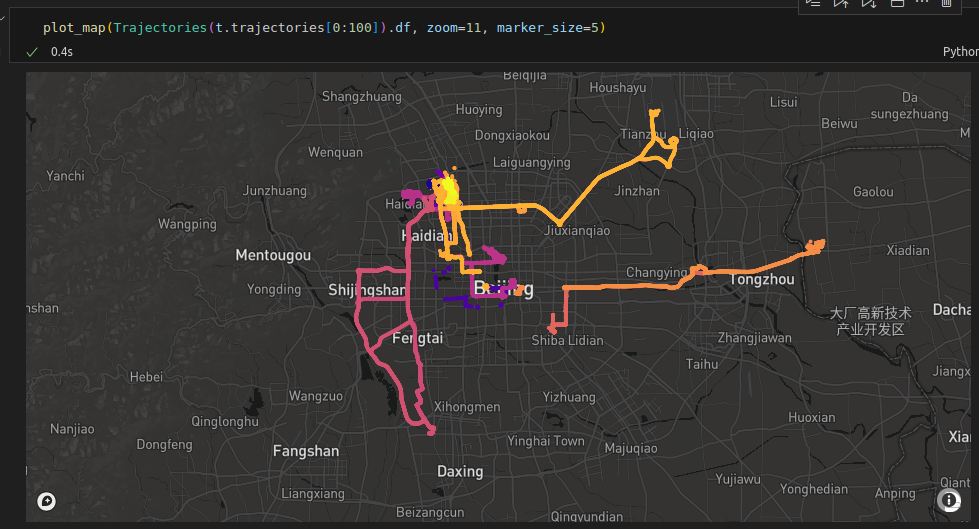
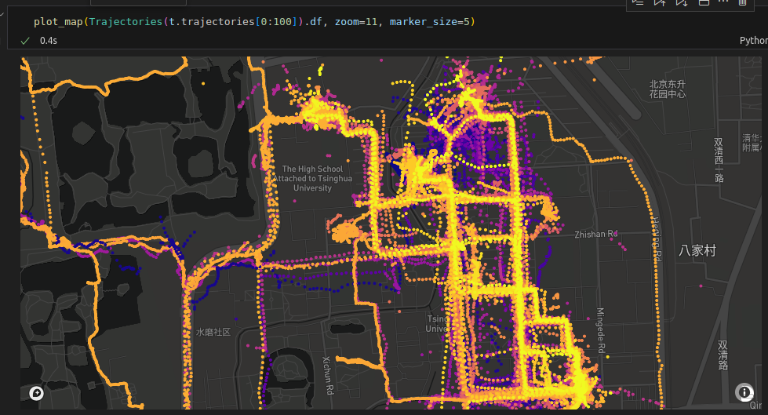
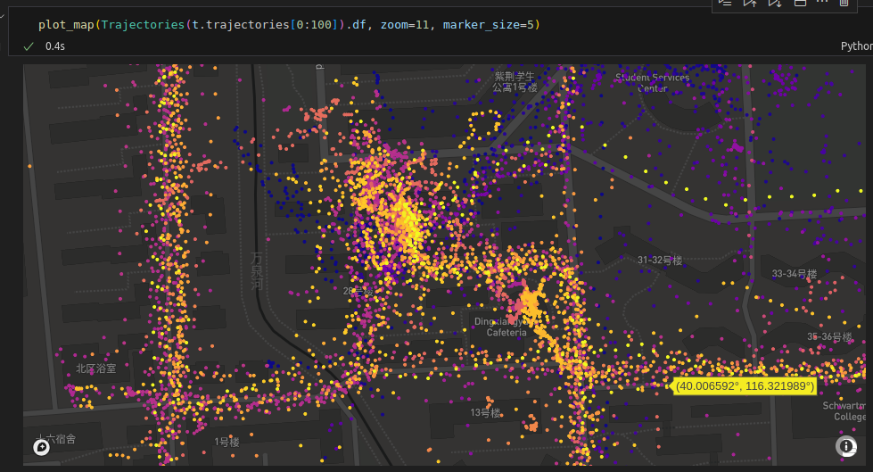
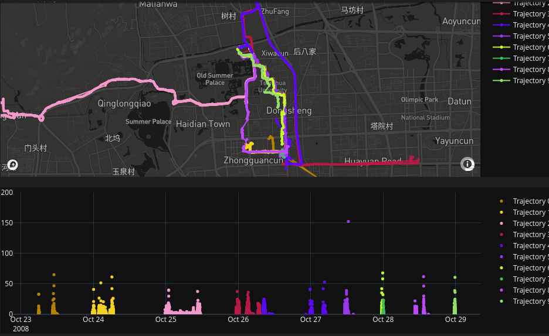
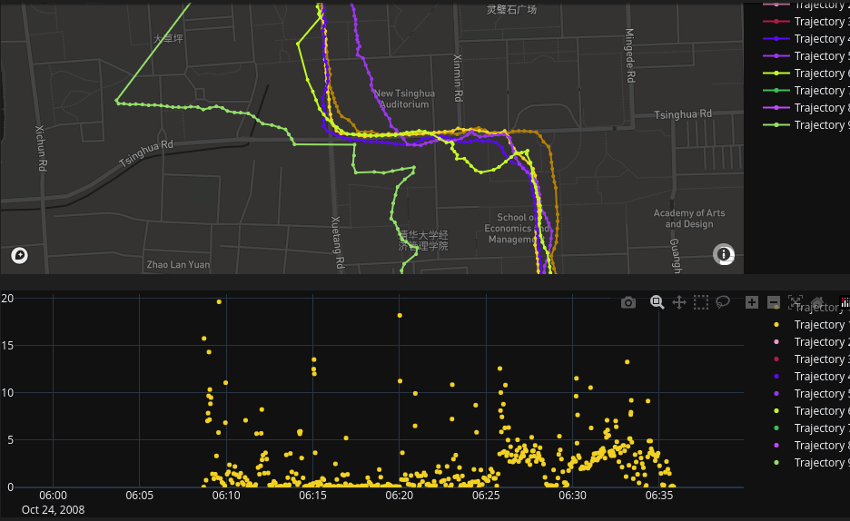

## - work in progress - 

# Building a GPS tracking web application using Dash/Plotly framework

## GeoLife GPS Trajectory dataset
https://www.microsoft.com/en-us/research/publication/geolife-gps-trajectory-dataset-user-guide/

This GPS trajectory dataset was collected in (Microsoft Research Asia) Geolife project by 182 users in a period of over three years (from April 2007 to August 2012). A GPS trajectory of this dataset is represented by a sequence of time-stamped points, each of which contains the information of latitude, longitude and altitude. This dataset contains 17,621 trajectories with a total distance of about 1.2 million kilometers and a total duration of 48,000+ hours. These trajectories were recorded by different GPS loggers and GPS-phones, and have a variety of sampling rates. 91 percent of the trajectories are logged in a dense representation, e.g. every 1~5 seconds or every 5~10 meters per point. This dataset recoded a broad range of users’ outdoor movements, including not only life routines like go home and go to work but also some entertainments and sports activities, such as shopping, sightseeing, dining, hiking, and cycling. This trajectory dataset can be used in many research fields, such as mobility pattern mining, user activity recognition, location-based social networks, location privacy, and location recommendation. 

* [1] Yu Zheng, Lizhu Zhang, Xing Xie, Wei-Ying Ma. Mining interesting locations and travel sequences from GPS trajectories. In Proceedings of International conference on World Wild Web (WWW 2009), Madrid Spain. ACM Press: 791-800.

* [2] Yu Zheng, Quannan Li, Yukun Chen, Xing Xie, Wei-Ying Ma. Understanding Mobility Based on GPS Data. In Proceedings of ACM conference on Ubiquitous Computing (UbiComp 2008), Seoul, Korea. ACM Press: 312-321. [3] Yu Zheng, Xing Xie, Wei-Ying Ma, GeoLife: A Collaborative Social Networking Service among User, location and trajectory. Invited paper, in IEEE Data Engineering Bulletin. 33, 2, 2010, pp. 32-40.

